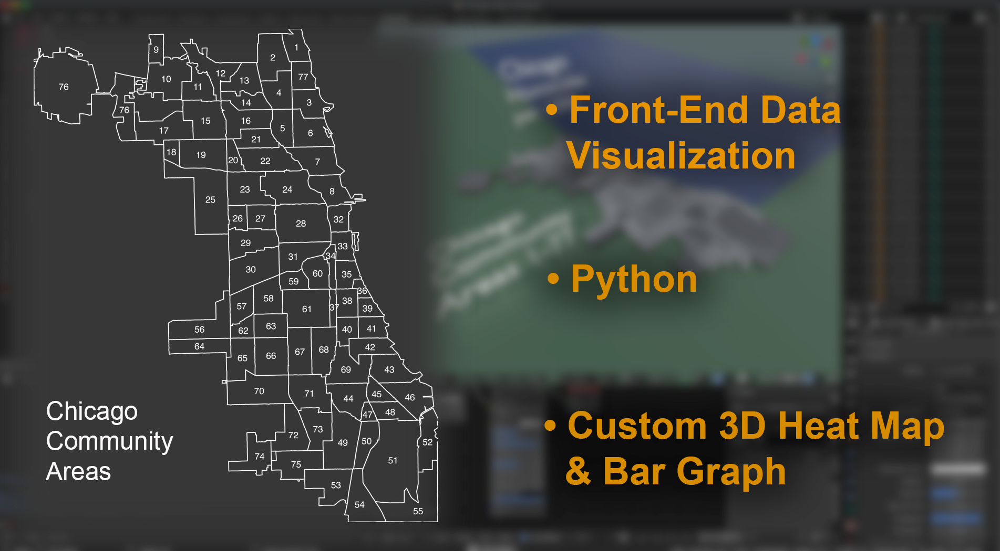
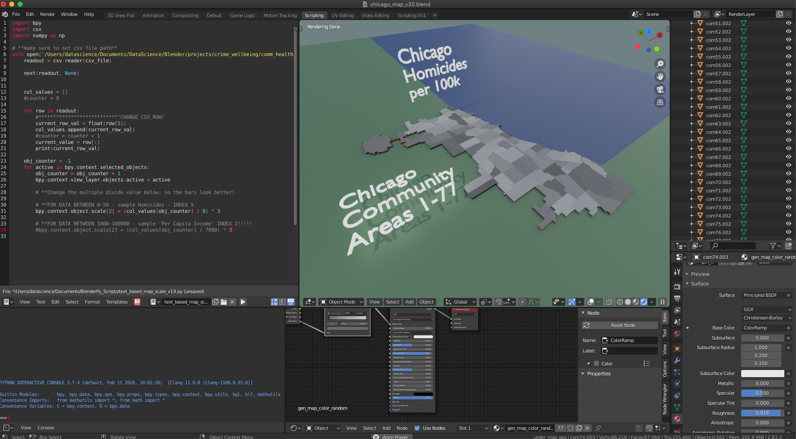
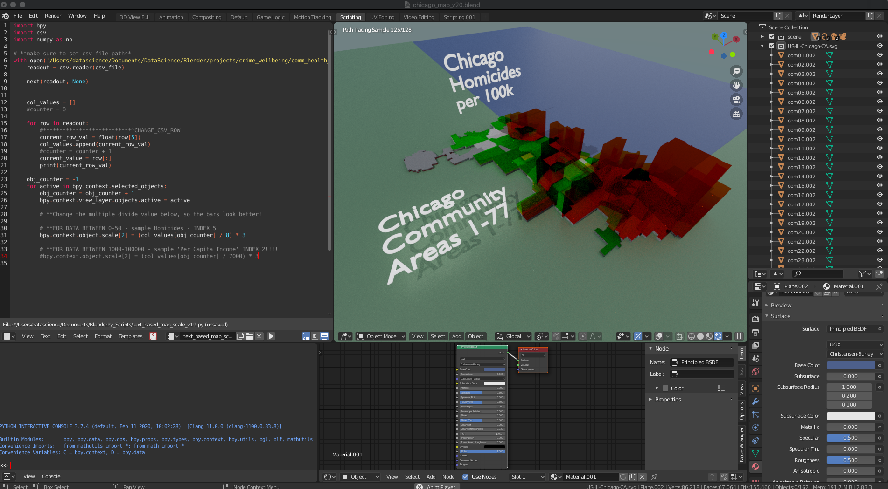
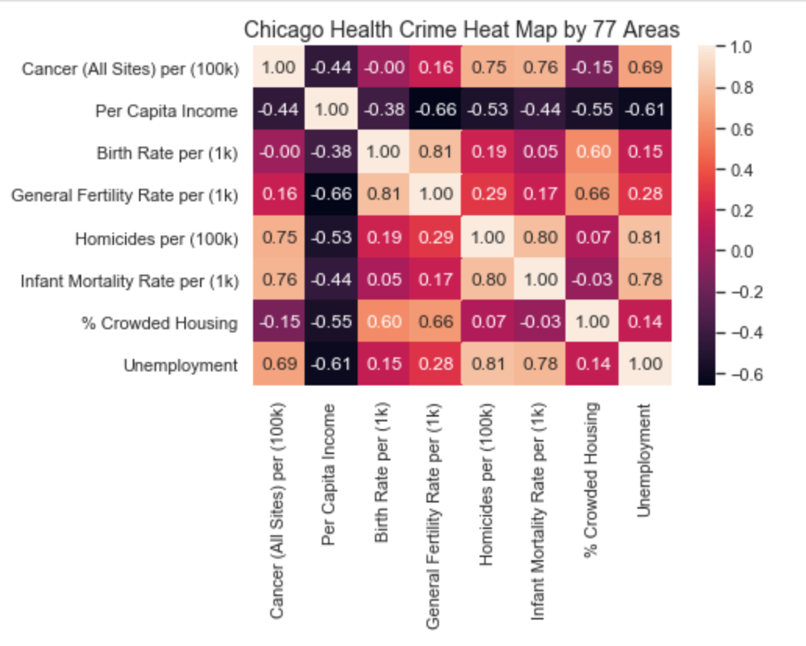
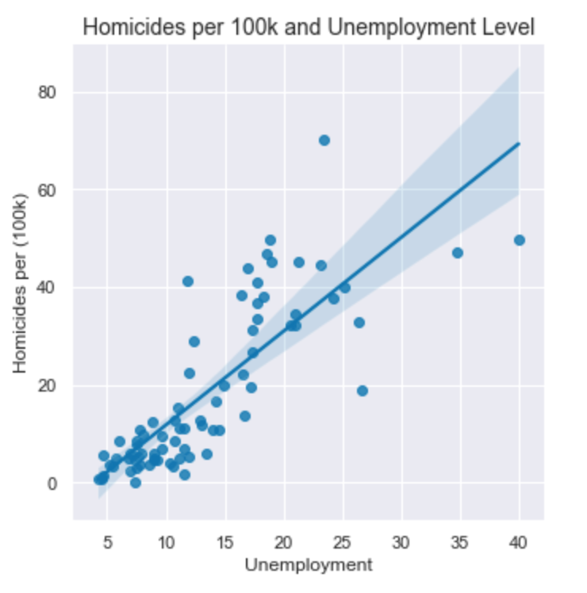
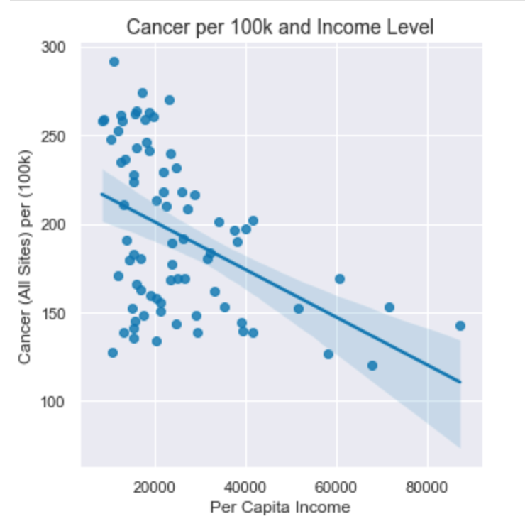
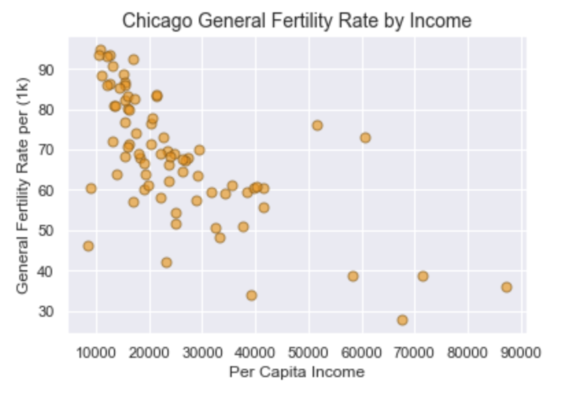
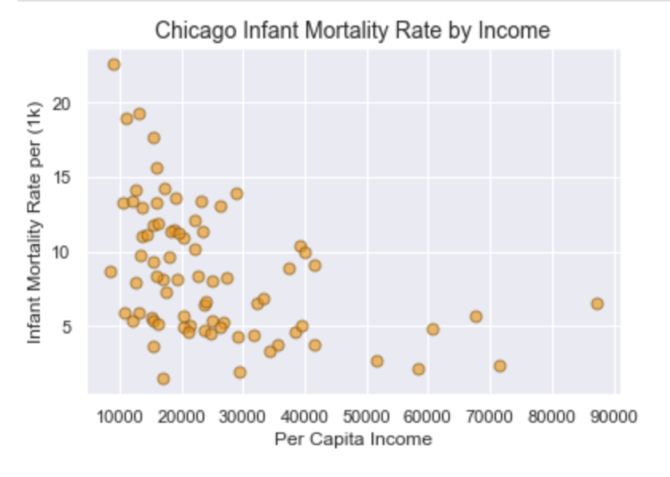

# Chicago Crime and Well-Being Project
# Data Visualization - Front-End
---
Using Blender 3D and Python, I created a custom neighborhood heat/bar map. Load a csv or json file grouped in order 1-77, of the 77 Chicago neighborhoods. The results visually display any data metric giving by neighborhood. This quickly displays the geographic disparities or prosperities of the Chicago neighborhoods.

&nbsp;
&nbsp;

&nbsp;
&nbsp;

&nbsp;
&nbsp;
# Data Analysis and Organization in Pandas/Jupyter Lab.
* Before I built my python Data Visualization program in Blender, I cleaned and crunched through the dataset from the Chicago Data Portal.
---

&nbsp;
&nbsp;

&nbsp;
&nbsp;

&nbsp;
&nbsp;

&nbsp;
&nbsp;

---
# Project Credits
* I could not have built this code without knowlegde from the Northwestern's Data and Visualization Program. Chris Prenninger's youtube channel. CG Masters youtube channel. Also, https://blender.stackexchange.com/, specifically user 'thorst'.