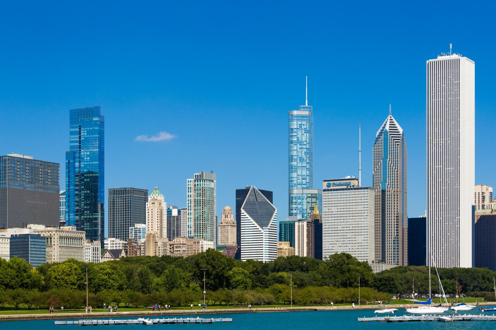

# Chicago Crime and Well Being Project

* Exploring Chicago's crime stats and correlation to general well being per neighborhood.

* Digging deep into crime events, income and common health issues in each Chicago Area.

* What factors stand out? 

