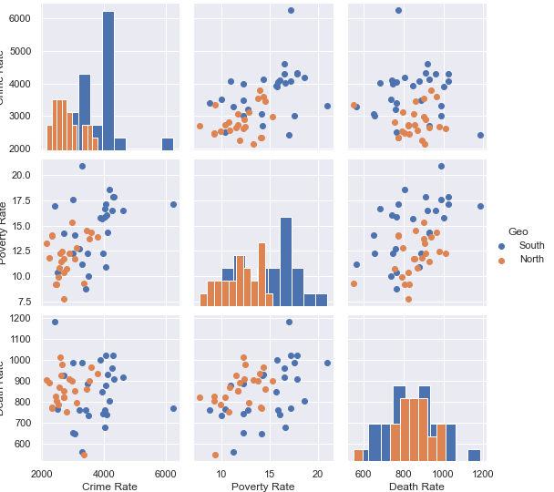
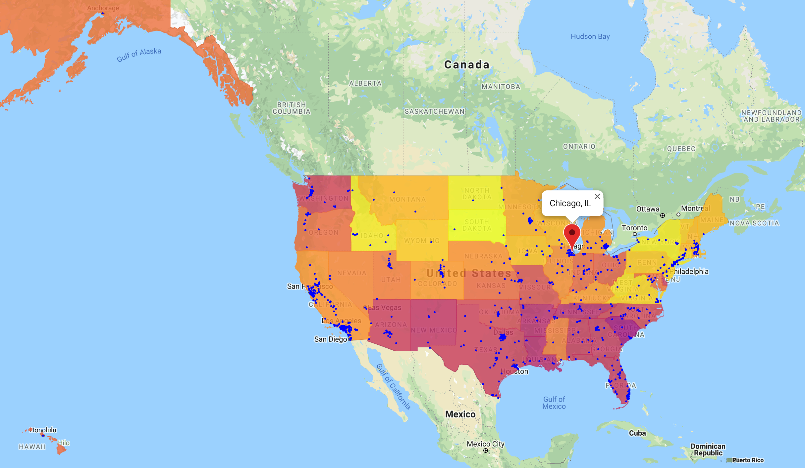
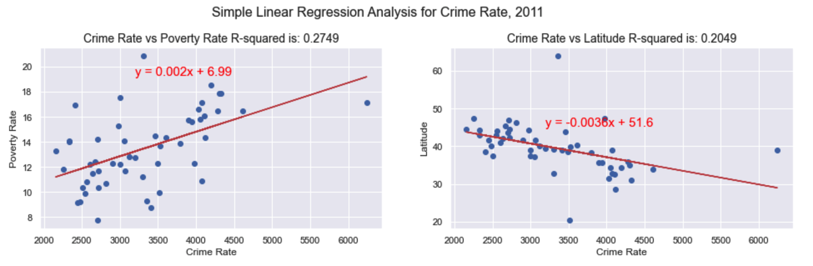

# CHICAGO CRIME & WELL-BEING  
## Group Project (State Level Analysis)

Data Science and Visualization Boot Camp (Northwestern University)


[](http://commonmark.org)
[](http://hits.dwyl.com/OlegRyzhkov2020/api-challenge)


## Data sources


## Data cleaning and updating

```python
 def cities_coord(df):
    for row in df.itertuples():
        client = GoogleMapClient(api_key = g_key, address_or_postal_code = f'{row.City}')
        try:
            df.loc[row.Index, 'Lat'] = client.lat
            df.loc[row.Index, 'Lng'] = client.lng
        except:
            pass
        if row.Index % 30 == 0:
            print('Processing records: found ', row.Index,' cities')
    print('\nProcessing is over\n')
    return df
```

## Data exploration




## Data Visualization




## Statistical Analysis

```python
# Regression Analysiss for 2011
crime_pov = DataAnalysis(expl_data_2011['Crime Rate'], expl_data_2011['Poverty Rate'])
crime_lat = DataAnalysis(expl_data_2011['Crime Rate'], expl_data_2011['Latitude'])

# using the variable axs for multiple Axes
plt.figure(figsize=(25, 4))
plt.subplot(131)
plt.suptitle('Simple Linear Regression Analysis for Crime Rate, 2011', x= 0.35, y=1.05, size=16)
crime_pov.scat_plot()
plt.subplot(132)
crime_lat.scat_plot()
```



## Contacts
[Find Me on
LinkedIn](https://www.linkedin.com/in/oleg-n-ryzhkov/)
