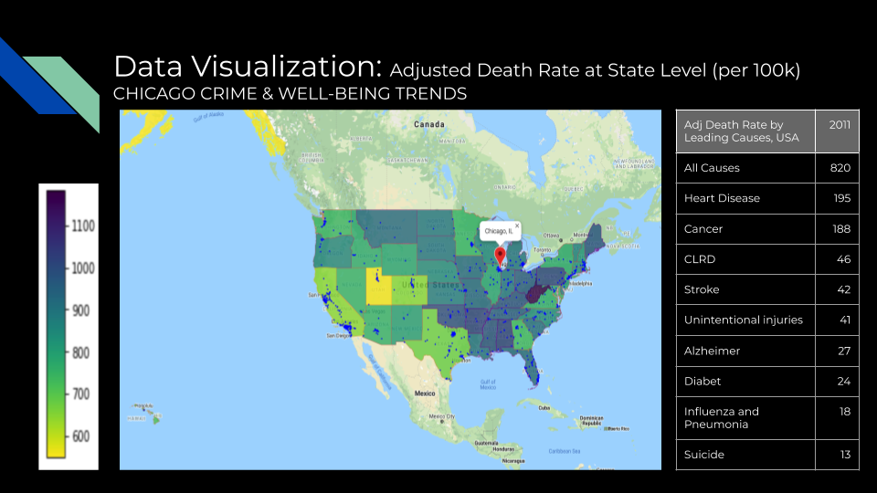
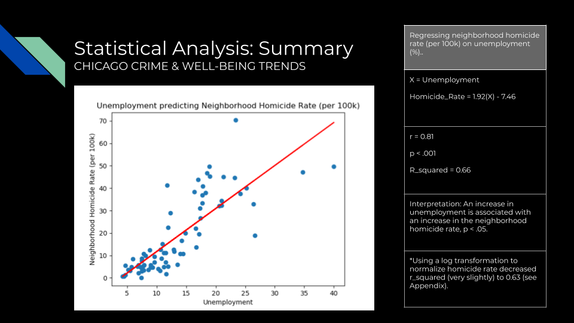
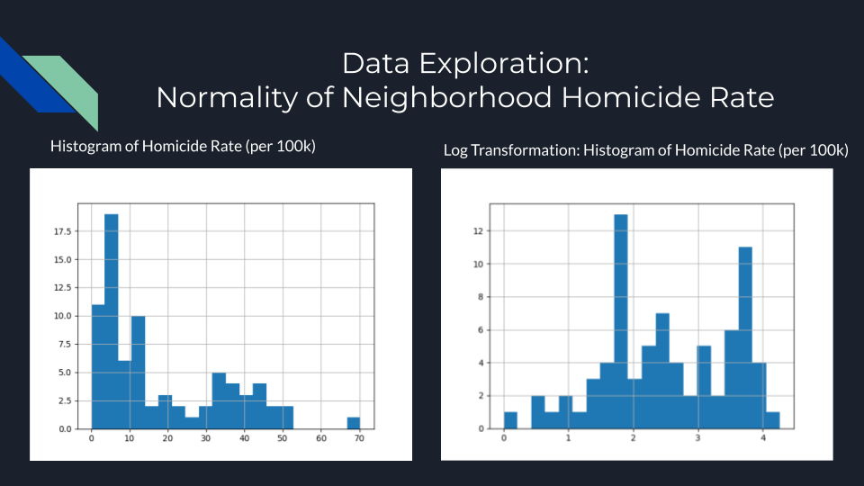
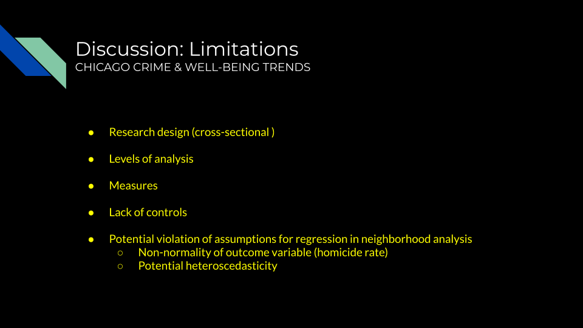
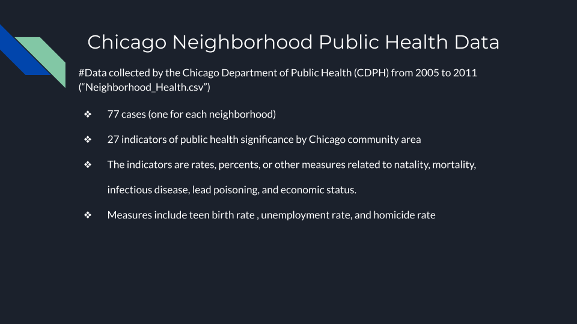

# Chicago Crime & Well-Being Project
RESEARCH TOPIC OVERVIEW

In this world crimes have become a normal part of our lives. We are interested in finding out whether there is any correlation between certain key variables in public health and economic factors that lead to criminal activity. Criminology theories suggest that certain types of sociological parameters (income, presence of authority etc.) determine and predispose people to commit crimes. We hope to use the data to prove or disprove these hypotheses in order to better understand criminal behaviour and whether they can be reduced to improve certain communities. A deeper  understanding  of these crime patterns and criminal behaviour can assist in largely strengthening city planning,Education reform, and police efforts that are ever present in this project and beyond.

---

---
# Git organization notes:
Each group member has their own branch organized with their working files. We are merging each branch's files to the master and organizing them into folders. Invidual project code files are in the 'code_projects' folder. **Note** If you open a jupyter or other individual file from the master, the related source data for that file, may be in a data or resource folder on the master repository.

